# DSH Model Think Level

<p align="center">
  <picture>
    <source media="(prefers-color-scheme: dark)" srcset="docs/banner-dark.svg">
    
  </picture>
</p>

[](LICENSE)
[](https://www.npmjs.com/package/dsh-model-think-level)
[](https://www.npmjs.com/package/dsh-model-think-level)

[](https://awesome-dsh-plugin.com)

**English** | [中文](README.zh.md)

Thinking levels, vision badges and request headers for **third-party models** in DeepSeek Harness — a provider → model picker with capability icons inside the official composer menu, a one-switch thinking gate plus auto-adapted levels inside the official Models page card, and per-route request headers. A renamed derivative of [dsh-better-reasoning-effort](https://github.com/HaoyueQin/dsh-better-reasoning-effort) — see [Acknowledgements](#acknowledgements).

<p align="center">
  
</p>

<p align="center">
  
</p>

## Why

The `llm-pi-ai` adapter natively supports per-model `reasoningEfforts` and `input` declarations, but the official Models page editor deliberately keeps both fields out of reach. As a result, third-party models get **no thinking-level picker** in the composer, only the official DeepSeek API can set reasoning effort, hand-declared models are treated as **text-only**, and configuring any of this meant hand-writing `settings.yaml` blocks. This plugin brings both configuration surfaces back into the UI: edit inside the official model editor card, plus one-click auto-adapt.

## Features

- **In-page editor** — a **Thinking** switch plus a reasoning-effort block appears under each model row's disclosure on the official Models page (levels, default effort, input modalities, endpoint compatibility), committing with the card's own **Save**; changes stay pending until then, and **Cancel** discards them with the card's fields. The switch sits **outside** that block and gates it: switched off, the model is written as not reasoning and the whole block is not rendered — one row is all an un-thinking model shows.
- **Auto-adapt** — one click fills recommended levels, wire spellings and modalities from a built-in knowledge base (65 entries across 15 vendors — see [Supported models](docs/supported-models.md)), wire-protocol inference, and a same-origin probe of the provider's raw `/models` listing, every suggestion labeled by confidence; reference capacities show as read-only hints you copy yourself. Beside the official **Get available models** link at the head of a provider's model list sits the plugin's own **Auto-detect thinking levels** (自动获取思考等级): one click runs that same adaptation over **every model of that provider at once**, so a newly added gateway does not need one click per row. It is deliberately the per-model action repeated, not a second write path — each mounted row runs its own auto-adapt and commits through the card's own pending state — so the result is byte-identical to clicking each row in turn, a read-only row or a save already in flight is skipped rather than raced, and the passes are queued one after another because each one reads the provider's own model list.
- **Auto-fill** — models without a declaration are filled at boot and when added mid-session (opt out via `autofill: false` / `modalityAutofill: false`); explicit declarations, `false` and deliberately-unset markers are never touched.
- **Three intents** — all levels off = unset (back to inheritance); only `off` = disable reasoning; levels armed = write the declaration.
- **Composer model & reasoning rows** — the official model menu's body renders a **Model** row and a **Reasoning level** row. The model row opens a provider column with that provider's models beside it, every entry carrying vision / thinking badges and the current pick marked in accent colour (no tick, so it cannot be mistaken for a badge); the reasoning row opens the model's own level list. The official trigger stays untouched, picks are optimistic and roll back on refusal, the popover stays open after a model switch so the level can be chosen next, and model switches keep your level through a per-session memory chain (issue #4's per-model default effort outranks it across sessions).
- **Composer model search** — a filter box above the official model list (provider / model / id tokens), always on.
- **Per-model default effort** — a "Default effort" picker on each model row, stored in the settings document; every new session starts the model there.
- **Request headers & `user-agent`** — a provider-card section edits the official `headers` field (masked, path-merged, Save-gated), and the plugin performs the `user-agent` override at the fetch layer per **provider route**, because the official adapter reserves that name. Routes that share one endpoint are told apart by their `baseURL` path and by the `model` carried in the request body, so each provider keeps its own identity; a request that identifies no single route falls back to the first declarer and the overlap is reported rather than guessed. Same-origin `/models` probes are covered.
- **Tabbed provider editor** — the provider card's one long column (identity fields, model list, request headers) is re-presented as three tabs — **Provider / Models / Advanced** (供应商配置 / 模型配置 / 高级配置) — with a segmented control that the plugin renders inside its own request-header section, above the panes. The official fields never move: each region is tagged and the visibility is decided in CSS, so the card's own Save/Cancel row stays put and an official redesign degrades back to the single-column editor untouched. The official "Customized" disclosure that folds the identity fields and the model list together is sorted into its panes and stays expanded for as long as the tabs are in charge. The editor's own header — the provider name and route tag printed at the top of the pane — repeats the card row sitting directly above it, so it is hidden on every tab; and the Models pane drops both of its hairlines — the "Customized" group's separator and the catalogue's own — together with every top padding that held content off them. Neither has anything to divide here: the identity fields the group's rule separated it from are not in this pane, and the tab bar above already ends the pane. What is left runs from the tab bar into the catalogue with only the editor's own 14px gap between blocks — no doubled line, and no blank space where a line used to be. The tags land in the same frame the official editor is committed in, so opening a card shows the tabbed editor directly — never the single column first, re-sorting itself a moment later. The same visit dresses the API-key field with a trailing **eye**: one click unmasks what is being typed or pasted just now, and on a saved provider it **fetches the stored key and puts it back into the field**. The eye belongs to that input, so both step aside on the cards the key manager takes over: the list below is where a key gets written there, and two ways to write one key on one card read as a conflict. The official page is write-only by design — the settings document carries only the profile's `apiKeyEnv` reference and the credential service never returns a value — so the plugin's own host route (`GET /dsh-model-think-level/provider-key?route=<route>`, the same trust fence as the raw-models probe) resolves it for the page, uncached and never logged. The read happens only on that click and only while the field is empty: a draft you typed is never overwritten, hiding gives a borrowed key back (an empty field is exactly what the official form reads as "keep the stored key"), and a resolve that comes back empty leaves the field masked with the reason in the button's tooltip. The mask and the button both go when the takeover withdraws. The **Advanced** tab is never collapsible: it holds the request-header section alone now, so folding it would leave the pane empty — the section keeps its disclosure header only while other regions still share the pane, and renders as a plain heading on its own tab.
- **Per-provider key manager** — the API-key field grows the provider's whole key list **inline, directly beneath the field**: one bordered list whose rows are every key configured for that provider route, closed by a full-width **Add another key** row. There is no icon chip, no `+` button and no floating panel — no key glyph sitting beside the official "API key" label printing the same word twice, and no layer to position against the dialog's opaque mask. Each row is the key's name — the alias — followed by its **masked** value, or the masked value alone when the row was never named (the mask is composed host-side, because only the host can resolve a stored credential), and closes on the **enable** radio: one circle per row, one enabled key per provider, so picking a row is what puts that key in use. Hovering a row — or focusing into it — reveals exactly three actions and nothing else: **Delete** (asks twice), **Alias** (renames only) and **Change key** (replaces that row's stored value). All three, plus adding, use the one form that opens **below the affected row** — name on the left, `Paste API key` on the right, then **Cancel** and the confirm button — never a dialog, and the value never leaves the host except as a mask. Exactly one key per route is in use, and enabling one writes the profile's `apiKeyEnv` — the single reference the adapter resolves — so the key in use is the same one the official page, the composer and every other consumer of that profile use, not a plugin-local notion. Labels are plugin state: the credential store has no enumeration and no labels, so the list lives in `<harness home>/dsh-model-think-level/key-index.json` — references and labels only, never a value — kept beside the harness home rather than inside the pi-ai profile, because the official add-provider card writes the whole profile at `providers.<route>`. Adding a key mints the next free reference server-side in one write (`ROUTE_API_KEY`, then `_2`, `_3`, …), stores the value **first** and lists it only once the store accepted it; removing the key in use hands the seat to the next listed key **before** the value is forgotten, and removing the last key clears the reference. A key whose value the store no longer holds stays listed and is flagged, so it can be re-added or removed. The list and its form are plugin-owned DOM in a host div appended as the key field's **next sibling** — the same anchored leaf the reveal eye is measured against — so they sit inside the dialog's own layout and need no z-index of their own; the form closes on **Cancel** or on a successful commit, and the host is swept on teardown, on a route change and when the pane leaves the provider tab.
- **Provider-list rows** — the official list of provider cards is dressed from the plugin side: each row carries an enable **switch** (switching a provider off greys its name and identity) and can be reordered by dragging its grip — the insertion line that says which side the row would land on is drawn above the settings dialog, so it is not swallowed by the overlay's opaque mask. Its action column also stays aligned, because the host renders a delete button only for a provider it allows removing — a built-in such as DeepSeek rendered none at all, so that row's remaining actions started further right than its neighbours'. The plugin fills that hole with a disabled **Delete** placeholder wearing the official row metrics (28px tall, the row's 12px label) at the host's own 40% disabled opacity, labelled with the host's own word for the action and tooltipped "a built-in provider cannot be deleted". The placeholder is handed back the moment the host renders its own button, and swept on teardown.
- **Defensive injection** — everything keys off the official page's DOM; if an official upgrade changes the structure, injection simply pauses and the official page is unaffected.
- Bilingual copy (中文 / English).

## Supported models

The auto-adapt knowledge base carries **65 curated entries across 15 vendors** (DeepSeek, OpenAI, Anthropic Claude, Gemini, Grok, Qwen, GLM, Kimi, Mistral, MiniMax, MiMo, Doubao, Hunyuan, Step, ERNIE — re-verified against official docs 2026-08/09, including vision-capable variants and no-effort-control families). The full table — match patterns, level → wire-spelling ladders, defaults, modalities, reference capacities — lives in **[docs/supported-models.md](docs/supported-models.md)** (generated from [`src/knowledge.ts`](src/knowledge.ts), the authoritative source). Unlisted models fall back to protocol inference + generic levels, adjustable by hand.

## Install

Requires DeepSeek Harness **`0.1.5-alpha.1` or later** (per-line peer ranges; the `0.1.2-rc` / `0.1.3-alpha` lines are no longer supported — use plugin `0.3.7` there). Compiled and gated against `0.2.0-rc.1`. The per-kernel seam re-checks behind this live in [docs/compatibility-notes.md](docs/compatibility-notes.md).

```bash
# from npm, under the dsh web profile
dsh plugin --profile web add dsh-model-think-level

# or from GitHub (source install; `lib/` builds via the prepare hook — the
# installer prints the `allowBuilds` key it needs, follow that and re-add)
dsh plugin --profile web add github:GaoHu1997/dsh-model-think-level

# or link a local checkout for development
npm install && npm run build
dsh plugin --profile web add link:D:/Project/dsh-model-think-level
```

Restart `dsh web` and hard-refresh the browser.

## Usage

1. Configure a third-party provider (API key etc.) on the official Models page.
2. Expand a model row: the **Thinking** switch sits above the effort block, and the block sits under the official capacity fields.
   - Leave **Thinking** on to configure levels. Switch it **off** and the model is saved as not reasoning — the whole effort block disappears with it, leaving just the switch row.
   - Check levels (off / minimal / low / medium / high / xhigh / max) and fill the wire values (e.g. give `high` the spelling `ultra`, and the gateway receives `ultra` when you pick High in the composer);
   - Toggle **Image input** under *Input modalities* to declare what the model accepts;
   - Click **Auto-adapt** to fill recommended levels and modalities — reference capacities show up as read-only hints you copy into the official fields yourself;
   - Any change is **pending** and lands when you press the card's own **Save**; **Cancel** (or a reload) discards it with the card's fields.
3. Above the model list, beside the official **Get available models** link, **Auto-detect thinking levels** runs that same adaptation over **every model of the provider at once** — one click instead of one per row. Each mounted row still runs its own auto-adapt and commits through the card's own pending state, so the outcome is what clicking **Auto-adapt** on every row in turn would produce; the passes are queued, because each one reads the provider's own model list.
4. On a compatible protocol, the *Endpoint compatibility* section appears at the bottom — thinking budget field / vLLM priority on `openai-completions`, `max_output_tokens` handling on `openai-responses`.
5. All levels off + Save = unset the declaration; only `off` checked + Save = disable reasoning (`false`); *Clear declaration* + Save = back to inheriting the provider default.
6. In the composer, open the model menu: the **Model** row lists providers on the left and that provider's models on the right — each model carries an eye badge when it accepts images and a sparkle badge when it reasons — and the **Reasoning level** row lists the levels of the current model. Picking a model closes its list but keeps the menu open, so the level can be picked right after.

7. The API-key field carries that provider's key list **inline**: the radio marks the key in use (the one the profile's `apiKeyEnv` points at), **Add another key** opens the form beneath the list, and hovering a row offers **Delete**, **Alias** and **Change key**.

Declared models are immediately selectable for reasoning effort in the composer, and image-declared models accept attachments end to end.

## Configuration

Optional on the plugin's profile row (values shown are the defaults):

```yaml
- insert:
    - id: dsh-model-think-level
      name: dsh-model-think-level
      config:
        autofill: true          # auto-fill undeclared models at boot
        modalityAutofill: true  # whether the boot fill also covers modalities
        probeTimeoutMs: 15000   # /models probe fetch timeout
        bootRetryDelaysMs: [1000, 2000, 4000, 8000, 16000, 30000]
        defaultGuard: true      # map effort-less calls on forced-thinking
                                # ladders to the vendor default
```

## How it works

```
Browser (lib/client.js)                  Host (lib/index.js)
├─ DOM injector                          └─ Auto-fill
│   MutationObserver on the models page      settings/document-updated →
│   → mounts EffortEditor in each            invalidates the host cache;
│     model row's disclosure                 browser idle pass fills models
├─ Composer injection
│   MutationObserver on the document
│   → ComposerSlider (root pane)
│   → model search box (model-list pane)
├─ EffortEditor (React component)             (knowledge base + inference)
│   level checkboxes / wire values /
│   input-modality toggle /
│   auto-adapt (zoned suggestions) / committed with the card's Save
│   └─ writes settings.mutate (llm-pi-ai)
├─ Key manager (provider card)
│   inline key list under the key field; add / alias / change-value
│   forms open under the affected row (one key in use per route)
│   └─ host route: key index + credentials (enable = apiKeyEnv write)
├─ Auto-detect thinking levels (catalogue head)
│   a seat beside the official "Get available models" link → one
│   event → every mounted row of that provider runs its own auto-adapt
```

- `suggestEfforts()` in `src/knowledge.ts` is the knowledge base + inference engine — a pure function shared by host and browser.
- `reconcile()` in `src/client/injection/models-page-editor.ts` locates model rows and mounts the editor; `src/client/index.ts` assembles the browser half, one module per seam in `src/client/injection/`.
- `reconcileEditorTabs()` in `src/client/injection/editor-tabs.ts` re-presents the open editor card as three tabs (Provider / Models / Advanced) — it tags each region and stamps the card with the active tab; the visibility is decided in the stylesheet, so no official node ever moves. The bar is React-rendered by `src/client/injection/editor-tab-bar.ts` inside the plugin's own request-header mount, so it is plugin-owned DOM rather than a foreign node in the official child list; the pass only classifies, tags and labels it. The same visit calls `revealKeyField()` in `src/client/injection/key-reveal.ts`, which gives the API-key field its reveal eye — the one node this plugin appends to official DOM, a positioned leaf removed again on teardown. It unmasks a draft in place, and for a saved provider it asks the host for the stored credential through `PROVIDER_KEY_PATH` in `src/constants.ts` (registered in `src/index.ts` beside the raw-models probe, under the same trust fence and explicitly uncached), writing the answer into the official input through the prototype value setter plus a bubbling `input` event so the official component adopts it; a reveal is always borrowed, so hiding empties the field again — which is what the official form reads as "keep the stored key". The compare-before-write helpers shared by the tab pass and the key reveal live in `src/client/injection/dom.ts`.
- `enhanceKeyManagerField()` in `src/client/injection/key-manager.ts` owns the inline key list under the API-key field (the eye stays in `key-reveal.ts`) and the host div the list and its form mount into; while the list is mounted the field's own input is hidden by the stylesheet, because the list says the same thing once per key and both in one card read as a conflict — the input stays in the DOM, so the official form still owns it and unmanaging the field brings it back; the list itself is the React component in `src/client/KeyManager.tsx`, which talks to the host through `src/client/key-manager-client.ts` (`KEY_INDEX_PATH`) — `list`, `add`, `enable`, `rename`, `replace` and `remove`. The host route in `src/index.ts` reads and writes the plugin's index through `src/key-index.ts` and moves the "in use" seat with `settings.mutate(llm-pi-ai, { op: 'set' | 'unset', path: ['providers', route, 'apiKeyEnv'] })`, retrying once on a revision conflict; reference minting, validation and alias normalisation are shared with the browser half through `src/key-refs.ts`, which also composes the mask (`first4…last4`, or a fixed dot run below twelve characters) so no unmasked value ever crosses the host boundary. The injected leaf is compared against the field's next sibling before it is appended, so a settled pass emits no mutation and cannot retrigger the page observer.
- `reconcileAutoEffortSeats()` in `src/client/injection/auto-effort-seat.ts` renders the provider-wide seat into the open card's catalogue head — one raw-DOM button after the official **Get available models** link, matched by position because that link's own label swaps to a fetching state mid-request, and identified by `data-bre-auto-effort`, which carries the route. The click publishes `AUTO_EFFORT_EVENT` (`src/client/auto-effort.ts`) instead of writing anything: the seat holds no write path of its own, so `EffortEditor` listens, checks the route against its own, and queues its own `autoAdapt()` — the queue is a single promise chain, so passes run one at a time in arrival order and a failure never stops the next. The seat reconciles on every pass (idempotently — a settled pass emits no mutation), re-reads the route at click time so a retyped Provider ID is followed, and is swept both in the pass's own early-exit branches and on teardown.
- `createEditorApi()` in `src/client/ops.ts` writes the declarations via `settings.mutate`, preserving every other row field and retrying once on a revision conflict.

## Development

```bash
npm run typecheck   # tsc strict check on src
npm test            # vitest: knowledge / inference / autofill / DOM injection / writing
npm run build       # lib/*.js + lib/client.js (module-loader bundle)
```

Compiled and gated against the `0.2.0-rc.1` official packages; see [docs/compatibility-notes.md](docs/compatibility-notes.md) for the per-kernel records.

## Known limitations

- Injection depends on the official Models page's DOM (aria-label/class); an official upgrade may pause injection until adapted — the official page is unaffected meanwhile.
- The auto-adapt probe route answers **loopback and IP-literal hosts only** (the core `/api` Host-allowlist discipline without `trustedHosts`), and **never follows redirects** — a gateway listing its models only behind a 30x simply yields no endpoint evidence; Auto-adapt falls back to the knowledge base and protocol inference.
- `reasoningEfforts` declarations are suggestions — what an endpoint actually accepts is up to its docs; tweak in the UI. The knowledge base is not exhaustive; families without an effort ladder carry no entry at all.
- Endpoint-compatibility switches are never auto-filled by design: they describe a gateway, not a model.
- The modality vocabulary follows pi-ai's core (`text` / `image` today); wider gateway support (PDF, audio, video) is recorded per family until the core vocabulary grows.
- Name-heuristic modality advice (vision-flavored ids) is deliberately low-confidence and labeled as such.
- Self-hosted relays: auto-fill pins `supportsDeveloperRole: false` on routes no official host claims (some upstreams reject the `developer` role); explicit values are never overwritten.
- Forced-thinking models (ladders without `off`, e.g. GLM-5.3): effort-less calls map to the vendor default instead of sending `thinking: disabled` — set `defaultGuard: false` to restore raw behavior.
- **Credentials inside `headers` are not redacted on disk**: the read-only view masks them, but the settings document still holds them in clear text — treat it like an API key.
- **The request-header section's edit-state detection reads an unofficial signal** (the official row exposes no data attribute for its editor state); if an official build renames that class root, the section stops appearing — never breaking the page.
- **Only one `user-agent` rewrite should be active**: sibling header plugins land on the same layer; the plugin detects and reports known ones, but the last writer on the wire wins.
- The request-layer takeover relies on the official adapter creating a fresh SDK client per request — guarded by an end-to-end test that fails loudly if that changes.
- **The per-provider key list is plugin state** (`<harness home>/dsh-model-think-level/key-index.json`): references and labels only, never a value, but removing a key forgets its value from the credential store, and uninstalling the plugin leaves the file behind. If a key is renamed or enabled from another window while the card is open, reload it (the list reads when the card opens, not live).

## Acknowledgements

This plugin is a renamed derivative of **[dsh-better-reasoning-effort](https://github.com/HaoyueQin/dsh-better-reasoning-effort) by [HaoyueQin](https://github.com/HaoyueQin)** (MIT). The request-header layer, the model knowledge base, the auto-adapt / auto-fill pipeline and the Models-page editor all come from that project — thank you for the original work. What changed here: the composer's effort slider was replaced by a provider → model picker plus a reasoning-level list, model entries gained vision / thinking badges, the selection tick was dropped in favour of an accent colour, and the per-model editor gained the master **Thinking** switch that gates it.

That project's own composer slider was **adapted from [dsh-reasoning-effort](https://github.com/HanaAyane/dsh-reasoning-effort) by [HanaAyane](https://github.com/HanaAyane)** (MIT); it is no longer shipped here, but the credit stands for the lineage. If you used the upstream plugin, remove it to avoid two effort controls on the same seat:

```bash
dsh plugin --profile web remove dsh-reasoning-effort
```

## Activity

[](https://gitstock.org/GaoHu1997/dsh-model-think-level/stock.svg)

## License

MIT
